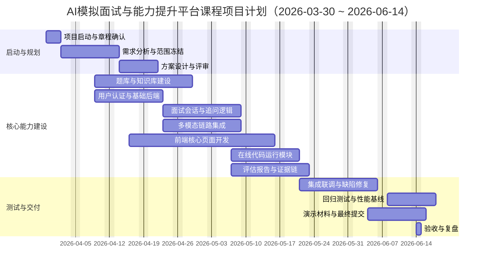

# AI模拟面试与能力提升平台 Project Charter

## 1. 项目基本信息
- 项目名称：AI模拟面试与能力提升平台
- 文档名称：AI模拟面试与能力提升平台 Project Charter
- 项目周期：2026-03-30 至 2026-06-14
- 项目类型：课程项目（软件系统研发）
- 项目负责人（组长）：薛漕洋
- 项目成员：邱婉盈、李璐巍、朱会佳
- 项目团队：
    - 需求与产品————薛漕洋
    - 后端与算法————薛漕洋、邱婉盈
    - 前端与交互————李璐巍、朱会佳
    - 测试与质量————李璐巍、朱会佳
    - 项目管理————薛漕洋、邱婉盈

## 2. 项目背景与立项依据
高校计算机相关专业学生在技术岗位求职面试中，普遍存在实战机会不足、反馈不及时且不客观、岗位准备不聚焦、能力成长不可追踪等问题。传统人工模拟面试难以高频提供一致化服务。

本项目拟构建“AI模拟面试与能力提升平台”，通过岗位化题库、语音与文本多模态交互、动态追问、多维评分与改进建议，形成“练习-评估-提升-复盘”的闭环，提升学生面试能力与求职竞争力。

## 3. 项目目标与成功标准
### 3.1 项目目标
- 支持至少2个岗位方向的差异化模拟面试。
- 支持文本与语音两种交互方式的多轮面试。
- 提供结构化评估报告（总分、分项分、亮点、不足、建议）。
- 支持历史记录查询、成长趋势与能力提升建议。

### 3.2 可量化成功标准（验收口径）
- 用户可完成一次完整面试闭环：登录/进入面试/多轮问答/查看报告。
- 两岗位题库可用，且具备基础难度区分。
- 文本链路与语音链路均可稳定跑通。
- 关键测试覆盖率目标不低于80%。

## 4. 项目范围
### 4.1 In Scope（本期范围）
- 用户认证与数据隔离。
- 岗位化题库与知识库（至少2个岗位）。
- 多轮面试编排（项目问答、技术问答、行为问答）。
- 语音转文字、LLM生成、文字转语音链路。
- 在线代码编辑与运行（Python/C++/Java）。
- 评估报告生成、证据链基础能力。
- 历史记录、成长趋势、基础通过率预测。

### 4.2 Out of Scope（本期不做）
- 企业级复杂权限中台与全量风控体系。
- 大规模多地域容灾与生产级高并发保障。
- 非技术岗位的完整题库覆盖。

## 5. 关键干系人与职责
- 项目发起人：课程教师，负责立项认可与阶段验收。
- 项目组长：进度统筹、风险管理、跨模块协调、对外交付。
- 需求与产品负责人：需求澄清、PRD维护、验收标准定义。
- 技术负责人：架构设计、关键技术选型、质量门禁。
- 开发成员：按模块完成功能开发与联调。
- 测试成员：测试用例设计、缺陷跟踪、回归与质量报告。

## 6. 里程碑计划
- M1（2026-04-06）：需求冻结与总体方案评审通过。
- M2（2026-04-20）：核心链路首通（登录、题库、文本面试）。
- M3（2026-05-04）：语音链路首通与基础报告生成。
- M4（2026-05-25）：多Agent评估、证据链、代码运行模块完成。
- M5（2026-06-08）：系统测试与回归完成，发布候选版本。
- M6（2026-06-14）：最终验收与课程材料提交完成。

## 7. RBS（需求分解结构）
### R1 业务与用户需求
- R1.1 岗位化模拟面试能力（至少2个岗位）
- R1.2 多模态交互能力（文本+语音）
- R1.3 动态追问与真实面试节奏
- R1.4 个性化训练与成长闭环

### R2 功能需求
- R2.1 用户认证与账号管理
- R2.2 题库与知识库管理
- R2.3 面试会话状态机与流程控制
- R2.4 在线代码编辑运行
- R2.5 评估引擎与报告生成
- R2.6 历史记录、趋势分析与预测

### R3 非功能需求
- R3.1 稳定性与可用性
- R3.2 性能与时延控制
- R3.3 安全与隐私
- R3.4 可维护性与可观测性

### R4 项目管理与交付需求
- R4.1 过程文档与评审记录
- R4.2 测试与质量门禁
- R4.3 演示材料与提交物完整性

## 8. WBS（工作分解结构）与工时估算
> 估算口径：团队总工时（人时），含开发、测试、文档与管理活动。

| WBS编码 | 工作包 | 主要产出 | 责任角色 | 估算工时（h） |
|---|---|---|---|---:|
| 1.0 | 项目启动与管理 | 章程、计划、周报、风险台账 | 组长/全员 | 56 |
| 2.0 | 需求分析与方案设计 | PRD、流程图、数据模型、接口草案 | 需求/技术 | 72 |
| 3.0 | 题库与知识库建设 | 题库数据、知识片段、检索配置 | 算法/后端 | 96 |
| 4.0 | 用户与权限模块 | 注册登录、鉴权、用户隔离 | 后端 | 48 |
| 5.0 | 面试会话与多轮追问 | 状态机、问答流程、追问逻辑 | 后端/算法 | 84 |
| 6.0 | 多模态链路开发 | ASR/LLM/TTS集成与降级策略 | 算法/后端 | 84 |
| 7.0 | 前端交互与页面实现 | 面试页、报告页、历史页 | 前端 | 92 |
| 8.0 | 在线代码运行模块 | 编辑器、编译运行、结果反馈 | 后端/前端 | 64 |
| 9.0 | 评估报告与证据链 | 评分规则、报告模板、证据映射 | 算法/后端 | 72 |
| 10.0 | 测试与质量保障 | 单测、集成测试、回归报告 | 测试/全员 | 88 |
| 11.0 | 发布与交付材料 | 部署脚本、演示视频、PPT、说明文档 | 全员 | 52 |
|  | **总计** |  |  | **808** |

### 8.1 阶段总工时汇总
- 规划与设计阶段（1.0-2.0）：128h
- 核心建设阶段（3.0-9.0）：540h
- 测试与交付阶段（10.0-11.0）：140h
- 项目总工时：808h

## 9. 进度计划（甘特图）

## 10. 关键假设与约束
### 10.1 假设
- 团队成员按计划投入，关键成员无长期缺席。
- 基础模型与语音组件可用，且本地环境满足运行要求。
- 课程周期内不发生大范围需求重定义。

### 10.2 约束
- 项目必须在2026-06-14前完成并提交。
- 课程项目资源有限，优先保证MVP闭环与可演示性。
- 开发工具与技术选型需兼顾学习成本与落地风险。

## 11. 主要风险与应对策略
| 风险 | 影响 | 概率 | 应对措施 |
|---|---|---|---|
| 需求变更频繁 | 返工、延期 | 中 | 需求冻结点+变更评审机制 |
| 语音链路不稳定 | 用户体验下降 | 中 | 失败重试+文本降级通道 |
| 多Agent评分分歧大 | 报告可信度下降 | 中 | 引入仲裁规则与证据链校验 |
| 联调阶段缺陷密集 | 质量风险上升 | 高 | 提前集成、每日回归、缺陷分级关闭 |
| 工时低估 | 里程碑延误 | 中 | 每周滚动重估并设置缓冲 |

## 12. 质量与验收策略
- 验收方式：按里程碑分阶段验收 + 最终全量验收。
- 测试策略：单元测试、接口测试、集成测试、回归测试。
- 质量门禁：核心链路可运行、关键缺陷清零、覆盖率达到课程目标。

## 13. 交付清单
- 项目概要介绍。
- 项目简介PPT。
- 项目详细方案（PRD与配套文档）。
- 项目演示视频。
- 本地知识库资料及必要补充材料。
- 本项目章程（Project Charter，含RBS/WBS/工时/进度计划）。
