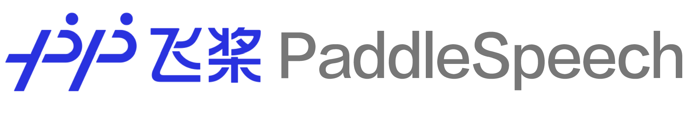

(简体中文|[English](./README.md))
<p align="center">
  
</p>


<p align="center">
    <a href="./LICENSE"></a>
    <a href="https://github.com/PaddlePaddle/PaddleSpeech/releases"></a>
    <a href="support os"></a>
    <a href=""></a>
    <a href="https://github.com/PaddlePaddle/PaddleSpeech/graphs/contributors"></a>
    <a href="https://github.com/PaddlePaddle/PaddleSpeech/commits"></a>
    <a href="https://github.com/PaddlePaddle/PaddleSpeech/issues"></a>
    <a href="https://github.com/PaddlePaddle/PaddleSpeech/stargazers"></a>
    <a href="=https://pypi.org/project/paddlespeech/"></a>
    <a href="=https://pypi.org/project/paddlespeech/"></a>
    <a href="https://huggingface.co/spaces"></a>
</p>
<div align="center">  
<h4>
    <a href="#安装"> 安装 </a>
  | <a href="#快速开始"> 快速开始 </a>
  | <a href="#教程文档"> 教程文档 </a>
  | <a href="#模型列表"> 模型列表 </a>
  | <a href="https://aistudio.baidu.com/aistudio/course/introduce/25130"> AIStudio 课程 </a>
  | <a href="https://arxiv.org/abs/2205.12007"> NAACL2022 论文 </a>
  | <a href="https://gitee.com/paddlepaddle/PaddleSpeech"> Gitee 
</h4>
</div>


------------------------------------------------------------------------------------

**PaddleSpeech** 是基于飞桨 [PaddlePaddle](https://github.com/PaddlePaddle/Paddle) 的语音方向的开源模型库，用于语音和音频中的各种关键任务的开发，包含大量基于深度学习前沿和有影响力的模型，一些典型的应用示例如下：

**PaddleSpeech** 荣获 [NAACL2022 Best Demo Award](https://2022.naacl.org/blog/best-demo-award/), 请访问 [Arxiv](https://arxiv.org/abs/2205.12007) 论文。
  
### 效果展示

##### 语音识别

<div align = "center">
<table style="width:100%">
  <thead>
    <tr>
      <th> 输入音频  </th>
      <th width="550"> 识别结果 </th>
    </tr>
  </thead>
  <tbody>
   <tr>
      <td align = "center">
      <a href="https://paddlespeech.cdn.bcebos.com/PaddleAudio/en.wav" rel="nofollow">
            </a><br>
      </td>
      <td >I knocked at the door on the ancient side of the building.</td>
    </tr>
    <tr>
      <td align = "center">
      <a href="https://paddlespeech.cdn.bcebos.com/PaddleAudio/zh.wav" rel="nofollow">
            </a><br>
      </td>
      <td>我认为跑步最重要的就是给我带来了身体健康。</td>
    </tr>
  </tbody>
</table>

</div>

##### 语音翻译 (英译中)

<div align = "center">
<table style="width:100%">
  <thead>
    <tr>
      <th> 输入音频 </th>
      <th width="550"> 翻译结果 </th>
    </tr>
  </thead>
  <tbody>
   <tr>
      <td align = "center">
      <a href="https://paddlespeech.cdn.bcebos.com/PaddleAudio/en.wav" rel="nofollow">
            </a><br>
      </td>
      <td >我 在 这栋 建筑 的 古老 门上 敲门。</td>
    </tr>
  </tbody>
</table>

</div>

##### 语音合成
<div align = "center">
<table style="width:100%">
  <thead>
    <tr>
      <th width="550">输入文本</th>
      <th>合成音频</th>
    </tr>
  </thead>
  <tbody>
   <tr>
      <td >Life was like a box of chocolates, you never know what you're gonna get.</td>
      <td align = "center">
      <a href="https://paddlespeech.cdn.bcebos.com/Parakeet/docs/demos/tacotron2_ljspeech_waveflow_samples_0.2/sentence_1.wav" rel="nofollow">
            </a><br>
      </td>
    </tr>
    <tr>
      <td >早上好，今天是2020/10/29，最低温度是-3°C。</td>
      <td align = "center">
      <a href="https://paddlespeech.cdn.bcebos.com/Parakeet/docs/demos/parakeet_espnet_fs2_pwg_demo/tn_g2p/parakeet/001.wav" rel="nofollow">
            </a><br>
      </td>
    </tr>
    <tr>
      <td >季姬寂，集鸡，鸡即棘鸡。棘鸡饥叽，季姬及箕稷济鸡。鸡既济，跻姬笈，季姬忌，急咭鸡，鸡急，继圾几，季姬急，即籍箕击鸡，箕疾击几伎，伎即齑，鸡叽集几基，季姬急极屐击鸡，鸡既殛，季姬激，即记《季姬击鸡记》。</td>
      <td align = "center">
      <a href="https://paddlespeech.cdn.bcebos.com/Parakeet/docs/demos/jijiji.wav" rel="nofollow">
            </a><br>
      </td>
    </tr>
    <tr>
      <td>大家好，我是 parrot 虚拟老师，我们来读一首诗，我与春风皆过客，I and the spring breeze are passing by，你携秋水揽星河，you take the autumn water to take the galaxy。</td>
      <td align = "center">
      <a href="https://paddlespeech.cdn.bcebos.com/Parakeet/docs/demos/labixiaoxin.wav" rel="nofollow">
            </a><br>
      </td>
    </tr>
    <tr>
      <td>宜家唔系事必要你讲，但系你所讲嘅说话将会变成呈堂证供。</td>
      <td align = "center">
      <a href="https://paddlespeech.cdn.bcebos.com/Parakeet/docs/demos/chengtangzhenggong.wav" rel="nofollow">
            </a><br>
      </td>
    </tr>
    <tr>
      <td>各个国家有各个国家嘅国歌</td>
      <td align = "center">
      <a href="https://paddlespeech.cdn.bcebos.com/Parakeet/docs/demos/gegege.wav" rel="nofollow">
            </a><br>
      </td>
    </tr>
  </tbody>
</table>

</div>

更多合成音频，可以参考 [PaddleSpeech 语音合成音频示例](https://paddlespeech.readthedocs.io/en/latest/tts/demo.html)。

##### 标点恢复
<div align = "center">
<table style="width:100%">
  <thead>
    <tr>
      <th width="390"> 输入文本 </th>
      <th width="390"> 输出文本 </th>
    </tr>
  </thead>
  <tbody>
   <tr>
      <td>今天的天气真不错啊你下午有空吗我想约你一起去吃饭</td>
      <td>今天的天气真不错啊！你下午有空吗？我想约你一起去吃饭。</td>
    </tr>
  </tbody>
</table>

</div>


### 特性

本项目采用了易用、高效、灵活以及可扩展的实现，旨在为工业应用、学术研究提供更好的支持，实现的功能包含训练、推断以及测试模块，以及部署过程，主要包括
- 📦 **易用性**: 安装门槛低，可使用 [CLI](#quick-start) 快速开始。
- 🏆 **对标 SoTA**: 提供了高速、轻量级模型，且借鉴了最前沿的技术。
- 🏆 **流式 ASR 和 TTS 系统**：工业级的端到端流式识别、流式合成系统。
- 💯 **基于规则的中文前端**: 我们的前端包含文本正则化和字音转换（G2P）。此外，我们使用自定义语言规则来适应中文语境。
- **多种工业界以及学术界主流功能支持**:
  - 🛎️ 典型音频任务: 本工具包提供了音频任务如音频分类、语音翻译、自动语音识别、文本转语音、语音合成、声纹识别、KWS等任务的实现。
  - 🔬 主流模型及数据集: 本工具包实现了参与整条语音任务流水线的各个模块，并且采用了主流数据集如 LibriSpeech、LJSpeech、AIShell、CSMSC，详情请见 [模型列表](#model-list)。
  - 🧩 级联模型应用: 作为传统语音任务的扩展，我们结合了自然语言处理、计算机视觉等任务，实现更接近实际需求的产业级应用。

### 近期更新
- 🎉 2025.09.01: 新增 [Whisper large v3 与 turbo 模型](https://github.com/PaddlePaddle/PaddleSpeech/tree/develop/demos/whisper).
- 🤗 2025.08.11: 新增 [流式中英混合 tal_cs 识别模型](./examples/tal_cs/asr1/).
- 👑 2023.05.31: 新增 [WavLM ASR-en](https://github.com/PaddlePaddle/PaddleSpeech/blob/develop/examples/librispeech/asr5), 基于WavLM的英语识别微调，使用LibriSpeech数据集
- 🎉 2023.05.18: 新增 [Squeezeformer](https://github.com/PaddlePaddle/PaddleSpeech/tree/develop/examples/aishell/asr1), 使用Squeezeformer进行训练，使用Aishell数据集
- 👑 2023.05.04: 新增 [HuBERT ASR-en](https://github.com/PaddlePaddle/PaddleSpeech/blob/develop/examples/librispeech/asr4), 基于HuBERT的英语识别微调，使用LibriSpeech数据集
- ⚡ 2023.04.28: 修正 [0-d tensor](https://github.com/PaddlePaddle/PaddleSpeech/pull/3214), 配合PaddlePaddle2.5升级修改了0-d tensor的问题。
- 👑 2023.04.25: 新增 [U2 conformer 的 AMP 训练](https://github.com/PaddlePaddle/PaddleSpeech/pull/3167).
- 👑 2023.04.06: 新增 [srt格式字幕生成功能](./demos/streaming_asr_server)。
- 🔥 2023.03.14: 新增基于 Opencpop 数据集的 SVS (歌唱合成) 示例，包含 [DiffSinger](./examples/opencpop/svs1)、[PWGAN](./examples/opencpop/voc1) 和 [HiFiGAN](./examples/opencpop/voc5)，效果持续优化中。
- 👑 2023.03.09: 新增 [Wav2vec2ASR-zh](./examples/aishell/asr3)。
- 🎉 2023.03.07: 新增 [TTS ARM Linux C++ 部署示例 (包含 C++ 中文文本前端模块)](./demos/TTSArmLinux)。
- 🔥 2023.03.03: 新增声音转换模型 [StarGANv2-VC 合成流程](./examples/vctk/vc3)。
- 🎉 2023.02.16: 新增[粤语语音合成](./examples/canton/tts3)。
- 🔥 2023.01.10: 新增[中英混合 ASR CLI 和 Demos](./demos/speech_recognition)。
- 👑 2023.01.06: 新增 [ASR 中英混合 tal_cs 训练推理流程](./examples/tal_cs/asr1/)。
- 🎉 2022.12.02: 新增[端到端韵律预测全流程](./examples/csmsc/tts3_rhy) (包含在声学模型中使用韵律标签)。
- 🎉 2022.11.30: 新增 [TTS Android 部署示例](./demos/TTSAndroid)。
- 🤗 2022.11.28: PP-TTS and PP-ASR 示例可在 [AIStudio](https://aistudio.baidu.com/aistudio/modelsoverview) 和[飞桨官网](https://www.paddlepaddle.org.cn/models)体验！
- 👑 2022.11.18: 新增 [Whisper CLI 和 Demos](https://github.com/PaddlePaddle/PaddleSpeech/pull/2640), 支持多种语言的识别与翻译。
- 🔥 2022.11.18: 新增 [Wav2vec2 CLI 和 Demos](./demos/speech_ssl), 支持 ASR 和特征提取。
- 🎉 2022.11.17: TTS 新增[高质量男性音色](https://github.com/PaddlePaddle/PaddleSpeech/pull/2660)。
- 🔥 2022.11.07: 新增 [U2/U2++ 高性能流式 ASR C++ 部署](./speechx/examples/u2pp_ol/wenetspeech)。
- 👑 2022.11.01: [中英文混合 TTS](./examples/zh_en_tts/tts3) 新增 [Adversarial Loss](https://arxiv.org/pdf/1907.04448.pdf) 模块。
- 🔥 2022.10.26: TTS 新增[韵律预测](./develop/examples/other/rhy)功能。
- 🎉 2022.10.21: TTS 中文文本前端新增 [SSML](https://github.com/PaddlePaddle/PaddleSpeech/discussions/2538) 功能。
- 👑 2022.10.11: 新增 [Wav2vec2ASR-en](./examples/librispeech/asr3), 在 LibriSpeech 上针对 ASR 任务对 wav2vec2.0 的 finetuning。
- 🔥 2022.09.26: 新增 Voice Cloning, TTS finetune 和 [ERNIE-SAT](https://arxiv.org/abs/2211.03545) 到 [PaddleSpeech 网页应用](./demos/speech_web)。
- ⚡ 2022.09.09: 新增基于 ECAPA-TDNN 声纹模型的 AISHELL-3 Voice Cloning [示例](./examples/aishell3/vc2)。
- ⚡ 2022.08.25: 发布 TTS [finetune](./examples/other/tts_finetune/tts3) 示例。
- 🔥 2022.08.22: 新增 [ERNIE-SAT](https://arxiv.org/abs/2211.03545) 模型: [ERNIE-SAT-vctk](./examples/vctk/ernie_sat)、[ERNIE-SAT-aishell3](./examples/aishell3/ernie_sat)、[ERNIE-SAT-zh_en](./examples/aishell3_vctk/ernie_sat)。
- 🔥 2022.08.15: 将 [g2pW](https://github.com/GitYCC/g2pW) 引入 TTS 中文文本前端。
- 🔥 2022.08.09: 发布[中英文混合 TTS](./examples/zh_en_tts/tts3)。
- ⚡ 2022.08.03: TTS CLI 新增 ONNXRuntime 推理方式。
- 🎉 2022.07.18: 发布 VITS 模型: [VITS-csmsc](./examples/csmsc/vits)、[VITS-aishell3](./examples/aishell3/vits)、[VITS-VC](./examples/aishell3/vits-vc)。
- 🎉 2022.06.22: 所有 TTS 模型支持了 ONNX 格式。
- 🍀 2022.06.17: 新增 [PaddleSpeech 网页应用](./demos/speech_web)。
- 👑 2022.05.13: PaddleSpeech 发布 [PP-ASR](./docs/source/asr/PPASR_cn.md) 流式语音识别系统、[PP-TTS](./docs/source/tts/PPTTS_cn.md) 流式语音合成系统、[PP-VPR](docs/source/vpr/PPVPR_cn.md) 全链路声纹识别系统
- 👏🏻 2022.05.06: PaddleSpeech Streaming Server 上线！覆盖了语音识别（标点恢复、时间戳）和语音合成。
- 👏🏻 2022.05.06: PaddleSpeech Server 上线！覆盖了声音分类、语音识别、语音合成、声纹识别，标点恢复。
- 👏🏻 2022.03.28: PaddleSpeech CLI 覆盖声音分类、语音识别、语音翻译（英译中）、语音合成和声纹验证。
- 👏🏻 2021.12.10: PaddleSpeech CLI 支持语音分类, 语音识别, 语音翻译（英译中）和语音合成。


 ### 🔥 加入技术交流群获取入群福利

 - 3 日直播课链接: 深度解读 【一句话语音合成】【小样本语音合成】【定制化语音识别】语音交互技术
 - 20G 学习大礼包：视频课程、前沿论文与学习资料
  
微信扫描二维码关注公众号，点击“马上报名”填写问卷加入官方交流群，获得更高效的问题答疑，与各行各业开发者充分交流，期待您的加入。

<div align="center">

</div>

<a name="安装"></a>
## 安装

我们强烈建议用户在 **Linux** 环境下，*3.8* 以上版本的 *python* 上安装 PaddleSpeech。

### 相关依赖
+ gcc >= 4.8.5
+ paddlepaddle
+ python >= 3.8
+ linux(推荐), mac, windows

PaddleSpeech 依赖于 paddlepaddle，安装可以参考[ paddlepaddle 官网](https://www.paddlepaddle.org.cn/)，根据自己机器的情况进行选择。这里给出 cpu 版本示例，其它版本大家可以根据自己机器的情况进行安装。

```shell
pip install paddlepaddle -i https://mirror.baidu.com/pypi/simple
```
你也可以安装指定版本的paddlepaddle，或者安装 develop 版本。
```bash
# 安装2.4.1版本. 注意：2.4.1只是一个示例，请按照对paddlepaddle的最小依赖进行选择。
pip install paddlepaddle==2.4.1 -i https://mirror.baidu.com/pypi/simple
# 安装 develop 版本
pip install paddlepaddle==0.0.0 -f https://www.paddlepaddle.org.cn/whl/linux/cpu-mkl/develop.html
```
PaddleSpeech 快速安装方式有两种，一种是 pip 安装，一种是源码编译（推荐）。

### pip 安装
```shell
pip install pytest-runner
pip install paddlespeech
```

### 源码编译
```shell
git clone https://github.com/PaddlePaddle/PaddleSpeech.git
cd PaddleSpeech
pip install pytest-runner
pip install .
# 如果需要在可编辑模式下安装，需要使用 --use-pep517，命令如下
# pip install -e . --use-pep517
```

更多关于安装问题，如 conda 环境，librosa 依赖的系统库，gcc 环境问题，kaldi 安装等，可以参考这篇[安装文档](docs/source/install_cn.md)，如安装上遇到问题可以在 [#2150](https://github.com/PaddlePaddle/PaddleSpeech/issues/2150) 上留言以及查找相关问题

<a name="快速开始"></a>
## 快速开始
安装完成后，开发者可以通过命令行或者 Python 快速开始，命令行模式下改变 `--input` 可以尝试用自己的音频或文本测试，支持 16k wav 格式音频。

你也可以在 `aistudio` 中快速体验 👉🏻[一键预测，快速上手 Speech 开发任务](https://aistudio.baidu.com/aistudio/projectdetail/4353348?sUid=2470186&shared=1&ts=1660878142250)。

测试音频示例下载
```shell
wget -c https://paddlespeech.cdn.bcebos.com/PaddleAudio/zh.wav
wget -c https://paddlespeech.cdn.bcebos.com/PaddleAudio/en.wav
```

### 语音识别
<details><summary>&emsp;（点击可展开）开源中文语音识别</summary>

命令行一键体验

```shell
paddlespeech asr --lang zh --input zh.wav
```

Python API 一键预测

```python
>>> from paddlespeech.cli.asr.infer import ASRExecutor
>>> asr = ASRExecutor()
>>> result = asr(audio_file="zh.wav")
>>> print(result)
我认为跑步最重要的就是给我带来了身体健康
```
</details>

### 语音合成

<details><summary>&emsp;开源中文语音合成</summary>

输出 24k 采样率wav格式音频


命令行一键体验

```shell
paddlespeech tts --input "你好，欢迎使用百度飞桨深度学习框架！" --output output.wav
```

Python API 一键预测

```python
>>> from paddlespeech.cli.tts.infer import TTSExecutor
>>> tts = TTSExecutor()
>>> tts(text="今天天气十分不错。", output="output.wav")
```
- 语音合成的 web demo 已经集成进了 [Huggingface Spaces](https://huggingface.co/spaces). 请参考: [TTS Demo](https://huggingface.co/spaces/KPatrick/PaddleSpeechTTS)

</details>

### 声音分类   

<details><summary>&emsp;适配多场景的开放领域声音分类工具</summary>

基于 AudioSet 数据集 527 个类别的声音分类模型

命令行一键体验

```shell
paddlespeech cls --input zh.wav
```

python API 一键预测

```python
>>> from paddlespeech.cli.cls.infer import CLSExecutor
>>> cls = CLSExecutor()
>>> result = cls(audio_file="zh.wav")
>>> print(result)
Speech 0.9027186632156372
```

</details>

### 声纹提取

<details><summary>&emsp;工业级声纹提取工具</summary>

命令行一键体验

```shell
paddlespeech vector --task spk --input zh.wav
```

Python API 一键预测

```python
>>> from paddlespeech.cli.vector import VectorExecutor
>>> vec = VectorExecutor()
>>> result = vec(audio_file="zh.wav")
>>> print(result) # 187维向量
[ -0.19083306   9.474295   -14.122263    -2.0916545    0.04848729
   4.9295826    1.4780062    0.3733844   10.695862     3.2697146
  -4.48199     -0.6617882   -9.170393   -11.1568775   -1.2358263 ...]
```

</details>

### 标点恢复 

<details><summary>&emsp;一键恢复文本标点，可与ASR模型配合使用</summary>

命令行一键体验

```shell
paddlespeech text --task punc --input 今天的天气真不错啊你下午有空吗我想约你一起去吃饭
```

Python API 一键预测

```python
>>> from paddlespeech.cli.text.infer import TextExecutor
>>> text_punc = TextExecutor()
>>> result = text_punc(text="今天的天气真不错啊你下午有空吗我想约你一起去吃饭")
今天的天气真不错啊！你下午有空吗？我想约你一起去吃饭。
```

</details>

### 语音翻译

<details><summary>&emsp;端到端英译中语音翻译工具</summary>

使用预编译的 kaldi 相关工具，只支持在 Ubuntu 系统中体验

命令行一键体验

```shell
paddlespeech st --input en.wav
```

python API 一键预测

```python
>>> from paddlespeech.cli.st.infer import STExecutor
>>> st = STExecutor()
>>> result = st(audio_file="en.wav")
['我 在 这栋 建筑 的 古老 门上 敲门 。']
```

</details>


<a name="快速使用服务"></a>
## 快速使用服务
安装完成后，开发者可以通过命令行一键启动语音识别，语音合成，音频分类等多种服务。

你可以在 AI Studio 中快速体验：[SpeechServer 一键部署](https://aistudio.baidu.com/aistudio/projectdetail/4354592?sUid=2470186&shared=1&ts=1660878208266)

**启动服务**     
```shell
paddlespeech_server start --config_file ./demos/speech_server/conf/application.yaml
```

**访问语音识别服务**     
```shell
paddlespeech_client asr --server_ip 127.0.0.1 --port 8090 --input input_16k.wav
```

**访问语音合成服务**     
```shell
paddlespeech_client tts --server_ip 127.0.0.1 --port 8090 --input "您好，欢迎使用百度飞桨语音合成服务。" --output output.wav
```

**访问音频分类服务**     
```shell
paddlespeech_client cls --server_ip 127.0.0.1 --port 8090 --input input.wav
```

更多服务相关的命令行使用信息，请参考 [demos](https://github.com/PaddlePaddle/PaddleSpeech/tree/develop/demos/speech_server)

<a name="快速使用流式服务"></a>
## 快速使用流式服务

开发者可以尝试 [流式 ASR](./demos/streaming_asr_server/README.md) 和 [流式 TTS](./demos/streaming_tts_server/README.md) 服务.

**启动流式 ASR 服务**

```
paddlespeech_server start --config_file ./demos/streaming_asr_server/conf/application.yaml
```

**访问流式 ASR 服务**     

```
paddlespeech_client asr_online --server_ip 127.0.0.1 --port 8090 --input input_16k.wav
```

**启动流式 TTS 服务**

```
paddlespeech_server start --config_file ./demos/streaming_tts_server/conf/tts_online_application.yaml
```

**访问流式 TTS 服务**     

```
paddlespeech_client tts_online --server_ip 127.0.0.1 --port 8092 --protocol http --input "您好，欢迎使用百度飞桨语音合成服务。" --output output.wav
```

更多信息参看： [流式 ASR](./demos/streaming_asr_server/README.md) 和 [流式 TTS](./demos/streaming_tts_server/README.md) 

<a name="模型列表"></a>
## 模型列表
PaddleSpeech 支持很多主流的模型，并提供了预训练模型，详情请见[模型列表](./docs/source/released_model.md)。

<a name="语音识别模型"></a>

PaddleSpeech 的 **语音转文本** 包含语音识别声学模型、语音识别语言模型和语音翻译, 详情如下：

<table style="width:100%">
  <thead>
    <tr>
      <th>语音转文本模块类型</th>
      <th>数据集</th>
      <th>模型类型</th>
      <th>脚本</th>
    </tr>
  </thead>
  <tbody>
    <tr>
      <td rowspan="4">语音识别</td>
      <td rowspan="2" >Aishell</td>
      <td >DeepSpeech2 RNN + Conv based Models</td>
      <td>
      <a href = "./examples/aishell/asr0">deepspeech2-aishell</a>
      </td>
    </tr>
    <tr>
      <td>Transformer based Attention Models </td>
      <td>
      <a href = "./examples/aishell/asr1">u2.transformer.conformer-aishell</a>
      </td>
    </tr>
      <tr>
      <td> Librispeech</td>
      <td>Transformer based Attention Models </td>
      <td>
      <a href = "./examples/librispeech/asr0">deepspeech2-librispeech</a> / <a href = "./examples/librispeech/asr1">transformer.conformer.u2-librispeech</a>  / <a href = "./examples/librispeech/asr2">transformer.conformer.u2-kaldi-librispeech</a>
      </td>
      </td>
    </tr>
    <tr>
      <td>TIMIT</td>
      <td>Unified Streaming & Non-streaming Two-pass</td>
      <td>
    <a href = "./examples/timit/asr1"> u2-timit</a>
      </td>
    </tr>
  <tr>
  <td>对齐</td>
  <td>THCHS30</td>
  <td>MFA</td>
  <td>
  <a href = ".examples/thchs30/align0">mfa-thchs30</a>
  </td>
  </tr>
   <tr>
      <td rowspan="1">语言模型</td>
      <td colspan = "2">Ngram 语言模型</td>
      <td>
      <a href = "./examples/other/ngram_lm">kenlm</a>
      </td>
    </tr>
    <tr>
      <td rowspan="2">语音翻译（英译中）</td> 
      <td rowspan="2">TED En-Zh</td>
      <td>Transformer + ASR MTL</td>
      <td>
      <a href = "./examples/ted_en_zh/st0">transformer-ted</a>
      </td>
  </tr>
  <tr>
      <td>FAT + Transformer + ASR MTL</td>
      <td>
      <a href = "./examples/ted_en_zh/st1">fat-st-ted</a>
      </td>
  </tr>
  </tbody>
</table>

<a name="语音合成模型"></a>

PaddleSpeech 的 **语音合成** 主要包含三个模块：文本前端、声学模型和声码器。声学模型和声码器模型如下：

<table>
  <thead>
    <tr>
      <th> 语音合成模块类型 </th>
      <th> 模型类型 </th>
      <th> 数据集  </th>
      <th> 脚本  </th>
    </tr>
  </thead>
  <tbody>
    <tr>
    <td> 文本前端</td>
    <td colspan="2"> &emsp; </td>
    <td>
    <a href = "./examples/other/tn">tn</a> / <a href = "./examples/other/g2p">g2p</a>
    </td>
   </tr>
   <tr>
      <td rowspan="6">声学模型</td>
      <td>Tacotron2</td>
      <td>LJSpeech / CSMSC</td>
      <td>
      <a href = "./examples/ljspeech/tts0">tacotron2-ljspeech</a> / <a href = "./examples/csmsc/tts0">tacotron2-csmsc</a>
      </td>
   </tr>
   <tr>
      <td>Transformer TTS</td>
      <td>LJSpeech</td>
      <td>
      <a href = "./examples/ljspeech/tts1">transformer-ljspeech</a>
      </td>
   </tr>
   <tr>
      <td>SpeedySpeech</td>
      <td>CSMSC</td>
      <td >
      <a href = "./examples/csmsc/tts2">speedyspeech-csmsc</a>
      </td>
   </tr>
   <tr>
      <td>FastSpeech2</td>
      <td>LJSpeech / VCTK / CSMSC / AISHELL-3 / ZH_EN / finetune</td>
      <td>
      <a href = "./examples/ljspeech/tts3">fastspeech2-ljspeech</a> / <a href = "./examples/vctk/tts3">fastspeech2-vctk</a> / <a href = "./examples/csmsc/tts3">fastspeech2-csmsc</a> / <a href = "./examples/aishell3/tts3">fastspeech2-aishell3</a> / <a href = "./examples/zh_en_tts/tts3">fastspeech2-zh_en</a> / <a href = "./examples/other/tts_finetune/tts3">fastspeech2-finetune</a>
      </td>
   </tr>
   <tr>
      <td><a href = "https://arxiv.org/abs/2211.03545">ERNIE-SAT</a></td>
      <td>VCTK / AISHELL-3 / ZH_EN</td>
      <td>
      <a href = "./examples/vctk/ernie_sat">ERNIE-SAT-vctk</a> / <a href = "./examples/aishell3/ernie_sat">ERNIE-SAT-aishell3</a> / <a href = "./examples/aishell3_vctk/ernie_sat">ERNIE-SAT-zh_en</a>
      </td>
   </tr>
   <tr>
      <td>DiffSinger</td>
      <td>Opencpop</td>
      <td>
      <a href = "./examples/opencpop/svs1">DiffSinger-opencpop</a>
      </td>
   </tr>
   <tr>
      <td rowspan="6">声码器</td>
      <td >WaveFlow</td>
      <td >LJSpeech</td>
      <td>
      <a href = "./examples/ljspeech/voc0">waveflow-ljspeech</a>
      </td>
    </tr>
    <tr>
      <td >Parallel WaveGAN</td>
      <td >LJSpeech / VCTK / CSMSC / AISHELL-3 / Opencpop</td>
      <td>
      <a href = "./examples/ljspeech/voc1">PWGAN-ljspeech</a> / <a href = "./examples/vctk/voc1">PWGAN-vctk</a> / <a href = "./examples/csmsc/voc1">PWGAN-csmsc</a> /  <a href = "./examples/aishell3/voc1">PWGAN-aishell3</a> / <a href = "./examples/opencpop/voc1">PWGAN-opencpop</a>
      </td>
    </tr>
    <tr>
      <td >Multi Band MelGAN</td>
      <td >CSMSC</td>
      <td>
      <a href = "./examples/csmsc/voc3">Multi Band MelGAN-csmsc</a> 
      </td>
    </tr>
    <tr>
      <td >Style MelGAN</td>
      <td >CSMSC</td>
      <td>
      <a href = "./examples/csmsc/voc4">Style MelGAN-csmsc</a> 
      </td>
    </tr>
    <tr>
      <td >HiFiGAN</td>
      <td >LJSpeech / VCTK / CSMSC / AISHELL-3 / Opencpop</td>
      <td>
      <a href = "./examples/ljspeech/voc5">HiFiGAN-ljspeech</a> / <a href = "./examples/vctk/voc5">HiFiGAN-vctk</a> / <a href = "./examples/csmsc/voc5">HiFiGAN-csmsc</a> / <a href = "./examples/aishell3/voc5">HiFiGAN-aishell3</a> / <a href = "./examples/opencpop/voc5">HiFiGAN-opencpop</a>
      </td>
    </tr>
    <tr>
      <td >WaveRNN</td>
      <td >CSMSC</td>
      <td>
      <a href = "./examples/csmsc/voc6">WaveRNN-csmsc</a>
      </td>
    </tr>
    <tr>
      <td rowspan="5">声音克隆</td>
      <td>GE2E</td>
      <td >Librispeech, etc.</td>
      <td>
      <a href = "./examples/other/ge2e">GE2E</a>
      </td>
    </tr>
    <tr>
      <td>SV2TTS (GE2E + Tacotron2)</td>
      <td>AISHELL-3</td>
      <td>
      <a href = "./examples/aishell3/vc0">VC0</a>
      </td>
    </tr>
    <tr>
      <td>SV2TTS (GE2E + FastSpeech2)</td>
      <td>AISHELL-3</td>
      <td>
      <a href = "./examples/aishell3/vc1">VC1</a>
      </td>
    </tr>
    <tr>
      <td>SV2TTS (ECAPA-TDNN + FastSpeech2)</td>
      <td>AISHELL-3</td>
      <td>
      <a href = "./examples/aishell3/vc2">VC2</a>
      </td>
    </tr>
    <tr>
      <td>GE2E + VITS</td>
      <td>AISHELL-3</td>
      <td>
      <a href = "./examples/aishell3/vits-vc">VITS-VC</a>
      </td>
    </tr>
     <tr>
      <td rowspan="3">端到端</td>
      <td>VITS</td>
      <td>CSMSC / AISHELL-3</td>
      <td>
      <a href = "./examples/csmsc/vits">VITS-csmsc</a> / <a href = "./examples/aishell3/vits">VITS-aishell3</a>
      </td>
    </tr>
  </tbody>
</table>


<a name="声音分类模型"></a>
**声音分类**

<table style="width:100%">
  <thead>
    <tr>
      <th> 任务 </th>
      <th> 数据集 </th>
      <th> 模型类型 </th>
      <th> 脚本</th>
    </tr>
  </thead>
  <tbody>
  <tr>
      <td>声音分类</td>
      <td>ESC-50</td>
      <td>PANN</td>
      <td>
      <a href = "./examples/esc50/cls0">pann-esc50</a>
      </td>
    </tr>
  </tbody>
</table>


<a name="语音唤醒模型"></a>

**语音唤醒**

<table style="width:100%">
  <thead>
    <tr>
      <th> 任务 </th>
      <th> 数据集 </th>
      <th> 模型类型 </th>
      <th> 脚本 </th>
    </tr>
  </thead>
  <tbody>
  <tr>
      <td>语音唤醒</td>
      <td>hey-snips</td>
      <td>MDTC</td>
      <td>
      <a href = "./examples/hey_snips/kws0">mdtc-hey-snips</a>
      </td>
    </tr>
  </tbody>
</table>

<a name="声纹识别模型"></a>

**声纹识别**

<table style="width:100%">
  <thead>
    <tr>
      <th> 任务 </th>
      <th> 数据集 </th>
      <th> 模型类型 </th>
      <th> 脚本 </th>
    </tr>
  </thead>
  <tbody>
  <tr>
      <td>声纹识别</td>
      <td>VoxCeleb1/2</td>
      <td>ECAPA-TDNN</td>
      <td>
      <a href = "./examples/voxceleb/sv0">ecapa-tdnn-voxceleb12</a>
      </td>
    </tr>
  </tbody>
</table>

<a name="说话人日志模型"></a>

**说话人日志**

<table style="width:100%">
  <thead>
    <tr>
      <th> 任务 </th>
      <th> 数据集 </th>
      <th> 模型类型 </th>
      <th> 脚本 </th>
    </tr>
  </thead>
  <tbody>
  <tr>
      <td>说话人日志</td>
      <td>AMI</td>
      <td>ECAPA-TDNN + AHC / SC</td>
      <td>
      <a href = "./examples/ami/sd0">ecapa-tdnn-ami</a>
      </td>
    </tr>
  </tbody>
</table>

<a name="标点恢复模型"></a>

**标点恢复**

<table style="width:100%">
  <thead>
    <tr>
      <th> 任务 </th>
      <th> 数据集 </th>
      <th> 模型类型 </th>
      <th> 脚本 </th>
    </tr>
  </thead>
  <tbody>
  <tr>
      <td>标点恢复</td>
      <td>IWLST2012_zh</td>
      <td>Ernie Linear</td>
      <td>
      <a href = "./examples/iwslt2012/punc0">iwslt2012-punc0</a>
      </td>
    </tr>
  </tbody>
</table>

<a name="教程文档"></a>
## 教程文档

对于 PaddleSpeech 的所关注的任务，以下指南有助于帮助开发者快速入门，了解语音相关核心思想。

- [下载安装](./docs/source/install_cn.md)
- [快速开始](#快速开始)
- Notebook基础教程
  - [声音分类](./docs/tutorial/cls/cls_tutorial.ipynb)
  - [语音识别](./docs/tutorial/asr/tutorial_transformer.ipynb)
  - [语音翻译](./docs/tutorial/st/st_tutorial.ipynb)
  - [声音合成](./docs/tutorial/tts/tts_tutorial.ipynb)
  - [示例Demo](./demos/README.md)
- 进阶文档  
  - [语音识别自定义训练](./docs/source/asr/quick_start.md)
    - [简介](./docs/source/asr/models_introduction.md)
    - [数据准备](./docs/source/asr/data_preparation.md)
    - [Ngram 语言模型](./docs/source/asr/ngram_lm.md)
  - [语音合成自定义训练](./docs/source/tts/quick_start.md)
    - [简介](./docs/source/tts/models_introduction.md)
    - [进阶用法](./docs/source/tts/advanced_usage.md)
    - [中文文本前端](./docs/source/tts/zh_text_frontend.md)
    - [测试语音样本](https://paddlespeech.readthedocs.io/en/latest/tts/demo.html)
  - 声纹识别
    - [声纹识别](./demos/speaker_verification/README_cn.md)
    - [音频检索](./demos/audio_searching/README_cn.md)
  - [声音分类](./demos/audio_tagging/README_cn.md)
  - [语音翻译](./demos/speech_translation/README_cn.md)
  - [服务化部署](./demos/speech_server/README_cn.md)
- [模型列表](#模型列表)
  - [语音识别](#语音识别模型)
  - [语音合成](#语音合成模型)
  - [声音分类](#声音分类模型)
  - [声纹识别](#声纹识别模型)
  - [说话人日志](#说话人日志模型)
  - [标点恢复](#标点恢复模型)
- [技术交流群](#技术交流群)
- [欢迎贡献](#欢迎贡献)
- [License](#License)


语音合成模块最初被称为 [Parakeet](https://github.com/PaddlePaddle/Parakeet)，现在与此仓库合并。如果您对该任务的学术研究感兴趣，请参阅 [TTS 研究概述](https://github.com/PaddlePaddle/PaddleSpeech/tree/develop/docs/source/tts#overview)。此外，[模型介绍](https://github.com/PaddlePaddle/PaddleSpeech/blob/develop/docs/source/tts/models_introduction.md) 是了解语音合成流程的一个很好的指南。


## ⭐ 应用案例
- **[PaddleBoBo](https://github.com/JiehangXie/PaddleBoBo): 使用 PaddleSpeech 的语音合成模块生成虚拟人的声音。**
  
<div align="center"><a href="https://www.bilibili.com/video/BV1cL411V71o?share_source=copy_web"></a></div>

- [PaddleSpeech 示例视频](https://paddlespeech.readthedocs.io/en/latest/demo_video.html)


- **[VTuberTalk](https://github.com/jerryuhoo/VTuberTalk): 使用 PaddleSpeech 的语音合成和语音识别从视频中克隆人声。**

<div align="center">

</div>


## 引用

要引用 PaddleSpeech 进行研究，请使用以下格式进行引用。
```text
@InProceedings{pmlr-v162-bai22d,
  title = {{A}$^3${T}: Alignment-Aware Acoustic and Text Pretraining for Speech Synthesis and Editing},
  author = {Bai, He and Zheng, Renjie and Chen, Junkun and Ma, Mingbo and Li, Xintong and Huang, Liang},
  booktitle = {Proceedings of the 39th International Conference on Machine Learning},
  pages = {1399--1411},
  year = {2022},
  volume = {162},
  series = {Proceedings of Machine Learning Research},
  month = {17--23 Jul},
  publisher = {PMLR},
  pdf = {https://proceedings.mlr.press/v162/bai22d/bai22d.pdf},
  url = {https://proceedings.mlr.press/v162/bai22d.html},
}

@inproceedings{zhang2022paddlespeech,
    title = {PaddleSpeech: An Easy-to-Use All-in-One Speech Toolkit},
    author = {Hui Zhang, Tian Yuan, Junkun Chen, Xintong Li, Renjie Zheng, Yuxin Huang, Xiaojie Chen, Enlei Gong, Zeyu Chen, Xiaoguang Hu, dianhai yu, Yanjun Ma, Liang Huang},
    booktitle = {Proceedings of the 2022 Conference of the North American Chapter of the Association for Computational Linguistics: Human Language Technologies: Demonstrations},
    year = {2022},
    publisher = {Association for Computational Linguistics},
}

@inproceedings{zheng2021fused,
  title={Fused acoustic and text encoding for multimodal bilingual pretraining and speech translation},
  author={Zheng, Renjie and Chen, Junkun and Ma, Mingbo and Huang, Liang},
  booktitle={International Conference on Machine Learning},
  pages={12736--12746},
  year={2021},
  organization={PMLR}
}
```

<a name="欢迎贡献"></a>
## 参与 PaddleSpeech 的开发

热烈欢迎您在 [Discussions](https://github.com/PaddlePaddle/PaddleSpeech/discussions) 中提交问题，并在 [Issues](https://github.com/PaddlePaddle/PaddleSpeech/issues) 中指出发现的 bug。此外，我们非常希望您参与到 PaddleSpeech 的开发中！

### 贡献者
<p align="center">
<a href="https://github.com/zh794390558"></a>
<a href="https://github.com/Jackwaterveg"></a>
<a href="https://github.com/yt605155624"></a>
<a href="https://github.com/Honei"></a>
<a href="https://github.com/KPatr1ck"></a>
<a href="https://github.com/kuke"></a>
<a href="https://github.com/lym0302"></a>
<a href="https://github.com/SmileGoat"></a>
<a href="https://github.com/xinghai-sun"></a>
<a href="https://github.com/pkuyym"></a>
<a href="https://github.com/LittleChenCc"></a>
<a href="https://github.com/qingen"></a>
<a href="https://github.com/D-DanielYang"></a>
<a href="https://github.com/Mingxue-Xu"></a>
<a href="https://github.com/745165806"></a>
<a href="https://github.com/jerryuhoo"></a>
<a href="https://github.com/WilliamZhang06"></a>
<a href="https://github.com/chrisxu2016"></a>
<a href="https://github.com/iftaken"></a>
<a href="https://github.com/lfchener"></a>
<a href="https://github.com/BarryKCL"></a>
<a href="https://github.com/mmglove"></a>
<a href="https://github.com/gongel"></a>
<a href="https://github.com/luotao1"></a>
<a href="https://github.com/wanghaoshuang"></a>
<a href="https://github.com/kslz"></a>
<a href="https://github.com/JiehangXie"></a>
<a href="https://github.com/david-95"></a>
<a href="https://github.com/THUzyt21"></a>
<a href="https://github.com/buchongyu2"></a>
<a href="https://github.com/iclementine"></a>
<a href="https://github.com/phecda-xu"></a>
<a href="https://github.com/freeliuzc"></a>
<a href="https://github.com/ZeyuChen"></a>
<a href="https://github.com/ccrrong"></a>
<a href="https://github.com/AK391"></a>
<a href="https://github.com/qingqing01"></a>
<a href="https://github.com/0x45f"></a>
<a href="https://github.com/vpegasus"></a>
<a href="https://github.com/ericxk"></a>
<a href="https://github.com/Betterman-qs"></a>
<a href="https://github.com/sneaxiy"></a>
<a href="https://github.com/Doubledongli"></a>
<a href="https://github.com/apps/dependabot"></a>
<a href="https://github.com/kvinwang"></a>
<a href="https://github.com/chenkui164"></a>
<a href="https://github.com/PaddleZhang"></a>
<a href="https://github.com/billishyahao"></a>
<a href="https://github.com/BrightXiaoHan"></a>
<a href="https://github.com/jiqiren11"></a>
<a href="https://github.com/ryanrussell"></a>
<a href="https://github.com/GT-ZhangAcer"></a>
<a href="https://github.com/tensor-tang"></a>
<a href="https://github.com/hysunflower"></a>
<a href="https://github.com/oyjxer"></a>
<a href="https://github.com/JamesLim-sy"></a>
<a href="https://github.com/limpidezza"></a>
<a href="https://github.com/windstamp"></a>
<a href="https://github.com/AshishKarel"></a>
<a href="https://github.com/chesterkuo"></a>
<a href="https://github.com/YDX-2147483647"></a>
<a href="https://github.com/AdamBear"></a>
<a href="https://github.com/wwhu"></a>
<a href="https://github.com/lispc"></a>
<a href="https://github.com/harisankarh"></a>
<a href="https://github.com/pengzhendong"></a>
<a href="https://github.com/Jackiexiao"></a>
</p>

## 致谢
- 非常感谢 [HighCWu](https://github.com/HighCWu) 新增 [VITS-aishell3](./examples/aishell3/vits) 和 [VITS-VC](./examples/aishell3/vits-vc) 代码示例。
- 非常感谢 [david-95](https://github.com/david-95) 修复 TTS 句尾多标点符号出错的问题，贡献补充多条程序和数据。为 TTS 中文文本前端新增 [SSML](https://github.com/PaddlePaddle/PaddleSpeech/discussions/2538) 功能。
- 非常感谢 [BarryKCL](https://github.com/BarryKCL) 基于 [G2PW](https://github.com/GitYCC/g2pW) 对 TTS 中文文本前端的优化。
- 非常感谢 [yeyupiaoling](https://github.com/yeyupiaoling)/[PPASR](https://github.com/yeyupiaoling/PPASR)/[PaddlePaddle-DeepSpeech](https://github.com/yeyupiaoling/PaddlePaddle-DeepSpeech)/[VoiceprintRecognition-PaddlePaddle](https://github.com/yeyupiaoling/VoiceprintRecognition-PaddlePaddle)/[AudioClassification-PaddlePaddle](https://github.com/yeyupiaoling/AudioClassification-PaddlePaddle) 多年来的关注和建议，以及在诸多问题上的帮助。
- 非常感谢 [mymagicpower](https://github.com/mymagicpower) 采用PaddleSpeech 对 ASR 的[短语音](https://github.com/mymagicpower/AIAS/tree/main/3_audio_sdks/asr_sdk)及[长语音](https://github.com/mymagicpower/AIAS/tree/main/3_audio_sdks/asr_long_audio_sdk)进行 Java 实现。
- 非常感谢 [JiehangXie](https://github.com/JiehangXie)/[PaddleBoBo](https://github.com/JiehangXie/PaddleBoBo) 采用 PaddleSpeech 语音合成功能实现 Virtual Uploader(VUP)/Virtual YouTuber(VTuber) 虚拟主播。
- 非常感谢 [745165806](https://github.com/745165806)/[PaddleSpeechTask](https://github.com/745165806/PaddleSpeechTask) 贡献标点重建相关模型。
- 非常感谢 [kslz](https://github.com/kslz) 补充中文文档。
- 非常感谢 [awmmmm](https://github.com/awmmmm) 提供 fastspeech2 aishell3 conformer 预训练模型。
- 非常感谢 [phecda-xu](https://github.com/phecda-xu)/[PaddleDubbing](https://github.com/phecda-xu/PaddleDubbing) 基于 PaddleSpeech 的 TTS 模型搭建带 GUI 操作界面的配音工具。
- 非常感谢 [jerryuhoo](https://github.com/jerryuhoo)/[VTuberTalk](https://github.com/jerryuhoo/VTuberTalk) 基于 PaddleSpeech 的 TTS GUI 界面和基于 ASR 制作数据集的相关代码。
- 非常感谢 [vpegasus](https://github.com/vpegasus)/[xuesebot](https://github.com/vpegasus/xuesebot) 基于 PaddleSpeech 的 ASR 与 TTS 设计的可听、说对话机器人。
- 非常感谢 [chenkui164](https://github.com/chenkui164)/[FastASR](https://github.com/chenkui164/FastASR) 对 PaddleSpeech 的 ASR 进行 C++ 推理实现。
- 非常感谢 [heyudage](https://github.com/heyudage)/[VoiceTyping](https://github.com/heyudage/VoiceTyping) 基于 PaddleSpeech 的 ASR 流式服务实现的实时语音输入法工具。
- 非常感谢 [EscaticZheng](https://github.com/EscaticZheng)/[ps3.9wheel-install](https://github.com/EscaticZheng/ps3.9wheel-install) 对PaddleSpeech在Windows下的安装提供了无需Visua Studio，基于python3.9的预编译依赖安装包。
- 非常感谢 [chinobing](https://github.com/chinobing)/[FastAPI-PaddleSpeech-Audio-To-Text](https://github.com/chinobing/FastAPI-PaddleSpeech-Audio-To-Text) 利用 FastAPI 实现 PaddleSpeech 语音转文字，文件上传、分割、转换进度显示、后台更新任务并以 csv 格式输出。
- 非常感谢 [MistEO](https://github.com/MistEO)/[Pallas-Bot](https://github.com/MistEO/Pallas-Bot) 基于 PaddleSpeech TTS 的 QQ Bot 项目。

此外，PaddleSpeech 依赖于许多开源存储库。有关更多信息，请参阅 [references](./docs/source/reference.md)。

## License

PaddleSpeech 在 [Apache-2.0 许可](./LICENSE) 下提供。

## Stargazers over time

[](https://starchart.cc/PaddlePaddle/PaddleSpeech)
